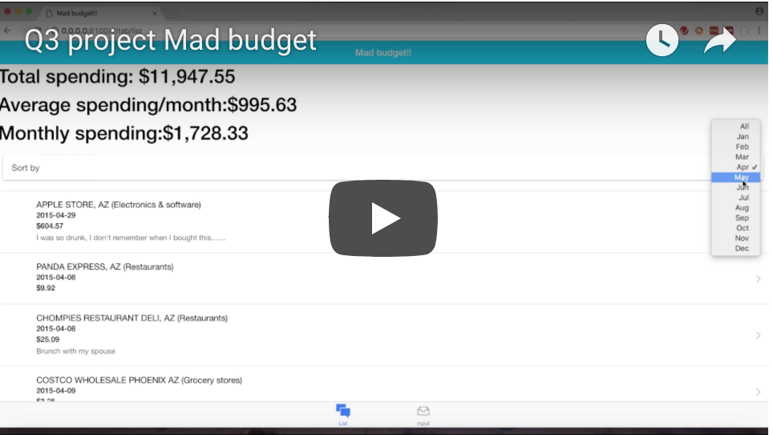

# Mad Budget

Mad budget app help you to review your spending habit.

You can see a preview of this app in action in the following video preview:

https://www.youtube.com/watch?v=oNwvWP17kNY&t=1s

`
**About the project**

Mad budget app help you to review your spending habit, and people who want to control their spending. You can review below items through this app.

- Purchased items
- Spending categories of purchased items
- Average spending per month

How this project is built
 - Front-end: HTML, CSS, Javascript, AngularJS, Ionic v1
 - Back-end: Nodejs, Express, PostgreSQL

**Future enhancements**
- Authentication
- Connect to a Banking API
- Chart, tables to review spending habit
